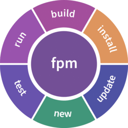

---
---
# INDEX OF THIS GITHUB SITE
## GitHub Stats

## Most Used Languages

---
---
## FEEDBACK REMINDER

Please provide feedback via the github "Issues", "Wiki", and "Discussion"
features on github.  If you use a module from this collection please
"star" the repository. If you did not use a module we are interested as
well as to why not, and what you did use.

Additionally discussion is welcome as well at

 - [Fortran Discourse](https://fortran-lang.discourse.group)
 - [Fortran Wiki](http://fortranwiki.org)
 - [Google Fortran newsgroup](https://groups.google.com/forum/#!forum/comp.lang.fortran)

<!--
Please provide feedback on the
[wiki](https://github.com/urbanjost/M_escape/wiki) or in the
[__issues__](https://github.com/urbanjost/M_escape/issues) section
-->
<!--
|name                    | description | repository |  pages |
|general-purpose-fortran | Collection of many generic modules into a single library| [X](https://github.com/urbanjost/general-purpose-fortran)| [X](https://urbanjost.github.io/general-purpose-fortran)|
|M_matrix | embeddable interpreted matrix-oriented language| [X](https://github.com/urbanjost/M_matrix)| [X](https://urbanjost.github.io/M_matrix)|
-->

---
## General Repository
 - [GPF](https://github.com/urbanjost/general-purpose-fortran) : GPF (General Purpose Fortran)
---
## Expression evaluation
 - [M_matrix](https://github.com/urbanjost/M_matrix) : embeddable matlab/octave-like interface
   allows for a Fortran program to invoke a command line interface for
   inspection, altering, saving, loading, ... data.
   + 
   + 
   + 
   + 
   + 
   + 
   + 
---
 - [M_calculator](https://github.com/urbanjost/M_calculator) : basic numeric expression parser 
   + 
   + 
   + 
   + 
   + 
   + 
   + 
---
## Strings
 - [M_strings](https://github.com/urbanjost/M_strings/) : string manipulation 
   + 
   + 
   + 
   + 
   + 
   + 
   + 
---
## Regular expressions
 - [M_change](https://github.com/urbanjost/M_change/) : Basic Regular Expressions 
   + 
   + 
   + 
   + 
   + 
   + 
   + 
---
 - [M_match](https://github.com/urbanjost/M_match/) : Basic Regular Expressions
---
## Posix and system interfaces
 - [M_system](https://github.com/urbanjost/M_system) : (mostly)POSIX system routine interface 
   + 
   + 
   + 
   + 
   + 
   + 
   + 
---
 - [M_process](https://github.com/urbanjost/M_process) : ISO_C_BINDING interface to popen(3c) and related system procedures 
   + 
   + 
   + 
   + 
   + 
   + 
   + 
---
 - [M_path](https://github.com/urbanjost/M_path/) : basic system file pathname operations
   + 
   + 
   + 
   + 
   + 
   + 
   + 
---
## I/O

  | name and link          | Description            | fpm support        | gmake support          | fpm registry  |
  | ---------------------- |----------------------- | ------------------ | ---------------------- | ------------- |
  | [M_io](https://github.com/urbanjost/M_io/) | I/O-related tools |  |  |  |

---
  | name and link          | Description            | fpm support        | gmake support          | fpm registry  |
  | ---------------------- |----------------------- | ------------------ | ---------------------- | ------------- |
  | [M_display](https://github.com/urbanjost/M_display/) | display of small matrices in row-column order |  |  |  |

   + 
   + 
   + 
   + 
   + 
   + 
   + 
## Date and time
 - [M_time](https://github.com/urbanjost/M_time) date and time conversion, formatting and computation 
   + 
   + 
   + 
   + 
   + 
   + 
   + 
---
## Command Line parsing
 - [M_CLI2](https://github.com/urbanjost/M_CLI2) : Unix-style commandline parsing using a prototype command 
   + 
   + 
   + 
   + 
   + 
   + 
   + 
---
 - [M_CLI](https://github.com/urbanjost/M_CLI) : Unix-style commandline parsing using a prototype command and NAMELIST 
---
 - [M_kracken](https://github.com/urbanjost/M_kracken95) :  command line parsing
---
 - [M_kracken95](https://github.com/urbanjost/M_kracken95) :  command line parsing using Fortran 95 
---
## Graphics
 - [M_draw](https://github.com/urbanjost/M_draw/) : basic vector graphics package 
---
 - [M_pixel](https://github.com/urbanjost/M_pixel/) : basic vector drawing into a pixel graphics format 
---
 - [M_color](https://github.com/urbanjost/M_color/) : conversions between common color models 
   + 
   + 
   + 
   + 
   + 
   + 
   + 
---
 - [M_calcomp](https://github.com/urbanjost/M_calcomp/) : old Calcomp look-alike graphics library. Not for new large code development
---
 - [M_slices](https://github.com/urbanjost/M_slices/) :  produce basic slice plot on POSIX systems with X11 Windows
---
## Preprocessing
 - [prep](https://github.com/urbanjost/prep) : A Fortran preprocessor written in Fortran
---
## Fortran documentation
 - [M_intrinsics](https://github.com/urbanjost/M_intrinsics) : module of text descriptions of Fortran intrinsics and features
    + [index of intrinsics](https://urbanjost.github.io/M_intrinsics/index3.html)
    + [index of statements](https://urbanjost.github.io/M_intrinsics/index7.html)
---
## Screen text control
 - [M_escape](https://github.com/urbanjost/M_escape/) : ANSI control escape sequences for attributes like color on video displays 
---
 - [M_attr](https://github.com/urbanjost/M_attr/) : ANSI control escape sequences for attributes like color on video displays
   + 
   + 
   + 
   + 
   + 
   + 
   + 
---
 - [M_ncurses](https://github.com/urbanjost/M_ncurses/) : Fortran-callable interface to the C library ncurses(3c)
---
## Sorting
 - [M_sort](https://github.com/urbanjost/M_sort/) : sorting
   + 
   + 
   + 
   + 
   + 
   + 
   + 
---
## Miscellaneous
 - [M_history](https://github.com/urbanjost/M_history/) : Input History Editor 
   + 
   + 
   + 
   + 
   + 
   + 
   + 
---
 - [M_list](https://github.com/urbanjost/M_list/) : standard intrinsic type dictionary toolkit
   + 
   + 
   + 
   + 
   + 
   + 
   + 
---
 - [M_msg](https://github.com/urbanjost/M_msg/) : converts any standard scalar type to a string and support unit testing 
---
 - [M_readline](https://github.com/urbanjost/M_readline/) : Fortran-callable interface to the C input history editor readline(3c)
---
 - [M_uuid](https://github.com/urbanjost/M_uuid/) : module to produce a UUID string
   + 
   + 
   + 
   + 
   + 
   + 
   + 
---
## Templates
 - [easy](https://github.com/urbanjost/easy/) : template for a github fpm package
   + 
   + 
   + 
   + 
   + 
   + 
   + 
---
---
# EXTERNAL SITES OF INTEREST
---
---
## Fortran Documentation

 - [Modern Fortran](http://cyber.dabamos.de/programming/modernfortran)
 - [GNU gfortran intrinsic descriptions](https://gcc.gnu.org/onlinedocs/gfortran/Intrinsic-Procedures.html)
 - [Fortran 2018 Standard](https://j3-fortran.org/doc/year/18/18-007r1.pdf)
 - [Intro to Fortran](https://www.nics.tennessee.edu/files/pdf/hpcss13_14/01_21_intro_to_fortran_pt2.pdf)

## Documentation generators

 - [ford](https://politicalphysicist.github.io/ford-fortran-documentation.html)
 - [doxygen](https://www.doxygen.nl/index.html)

## Lists
 - [Beliavsky's List](https://github.com/Beliavsky/Fortran-code-on-GitHub/blob/main/README.md)

## Standards
 - [J3](https://j3-fortran.org)

## Compilers
- [GNU gcc](http://gcc.gnu.org)

## Repositories
 - [netlib](http://www.netlib.org)
 - [Fortran Standard Library project](https://github.com/fortran-lang/stdlib/issues/229)
 - [index to Burkardt repository](https://github.com/Beliavsky/Burkardt-Fortran-90)

## Examples
 - [Rosetta Code](https://rosettacode.org)

---
## Fortran Package Manager (fpm) 
 - [fpm developer documentation](https://fortran-lang.github.io/fpm)
 - [fpm github site](https://github.com/fortran-lang/fpm)
 - [repository](https://github.com/fortran-lang/fpm-registry)
 - [package listing](https://fortran-lang.org/packages).

 - [PackageCon]( https://www.youtube.com/watch?v=g7ECnr_Q7Ck)
 - [fpm presentation](https://tcevents.chem.uzh.ch/event/12/contributions/39/attachments/35/104/Richardson-fpm-presentation.pdf)
 - [youtube:getting started with fpm](https://www.youtube.com/watch?v=pg77uR792YU)
 - [youtube:visual studio plugin](https://www.youtube.com/watch?v=pg77uR792YU)

### fpm packages
    + fpm-search : null
    + fpm-man : display Fortran intrinsics documentation
    + fpm-dict : fpm plug-in to look up words and descriptions on WWW using fortran-curl(3f)/libcurl(3c)
    + fpm-time : fpm plug-in to generate timing profiles using gprof(1)

---
## Packaging
 - [packing-con](http://packaging-con.org/)

## Discussion
 - [Fortran Discourse](https://fortran-lang.discourse.group)
 - [Google Fortran newsgroup](https://groups.google.com/forum/#!forum/comp.lang.fortran)
 - [Fortran Wiki](http://fortranwiki.org)
 - [twitter:Fortran Tips:Beliavsky](https://twitter.com/fortrantip)
 - [twitter:Steve Lionel](https://twitter.com/doctorfortran)
   [twitter:fortran-lang.org](https://twitter.com/fortranlang)
 - [Libera Chat](https://libera.chat/)

## Publications
 - [CISE](https://www.computer.org/csdl/magazine/cs)

## Configuration files and data serialization
 - [Discussion](http://degenerateconic.com/fortran-configuration-file-formats)
 - [TOML](https://github.com/toml-f/toml-f) : TOML parser implementation for data serialization and deserialization
 - [JSON](https://github.com/jacobwilliams/json-fortran)
 - jsonff : null
 - [XML]
 - [namelist]
 - [hdf5]

## Graphics
 - cairo-fortran : Fortran bindings for libcairo

## Other Packages
 - [fortran curl]( https://github.com/interkosmos/fortran-curl)
 - [spack](https://github.com/spack/spack.git)

## Presentations and Papers
 -[fortrancon-2020](http://degenerateconic.com/fortrancon-2020/)
 -[fortrancon-2021](https://degenerateconic.com/fortrancon-2021.html)
 -[CiSE article](https://github.com/LKedward/fortran-lang-CiSE-article)
 -[Fortran Forum article](git clone https://github.com/LKedward/fortran-forum-article-template)
}

## hash tables, linked lists, ...
 - fhash : Implements a hash table type with support for generic keys and values.

## Examples
 - [scivision examples](https://github.com/scivision/fortran2018-examples)

## Expression parsing

## System Interfaces

## Command line parsing
   + usage syntax: Unix-like, DOS-like, OpenVMS-like, ...
   + how hard to use from code? For example, what is the minimal program that can call the interface?
   + -a, --a, --a=value, combining short names
   + automatic GUI or TLI (X11, ncurses, ...)
   + simplistity of use versus features
      - converting values to _arrays_ and numbers from strings
      - validators
      - usage strings
      - help text
      - automatic help text
   + are "standard" switches automatically defined (--help, --version, --verbose ..)
   + query if a keyword was present on the call or not

  | name and link                                                               | Description                                                            | build methods |
  | --------------------------------------------------------------------------- | ---------------------------------------------------------------------- | ------------- |
  | [cmdff](https://gitlab.com/everythingfunctional/cmdff)                      |                                                                        |               |
  | [command_args](http://flibs.sourceforge.net/command_args.html)              | from \arjenmarkus (https://github.com/arjenmarkus)                     |               |
  | [f90getopt](https://github.com/haniibrahim/f90getopt)                       | based on Mark Gates routines                                           |               |
  | [FLAP](https://github.com/szaghi/FLAP)                                      |                                                                        |               |
  | [FTN_Getopt](https://doku.lrz.de/dyn/Doku_Kurse/Fortran/getopt/)            | by Reinhold Bader                                                      |               |
  | [getopt](https://doku.lrz.de/dyn/Doku_Kurse/Fortran/getopt)                 |                                                                        |               |
  | [libSUFR](https://github.com/MarcvdSluys/libSUFR)                           | by \MarcvdSluys (https://github.com/MarcvdSluys)                       |               |
  | [M_CLI2](https://github.com/urbanjost/M_CLI2)                               | Unix-style commandline parsing using a prototype.                      | fpm,make      |
  | [M_CLI](https://github.com/urbanjost/M_CLI)                                 | Unix-style commandline parsing using a prototype command and NAMELIST  | fpm,make      |
  | [M_kracken95](https://github.com/urbanjost/M_kracken95)                     | command line parsing using Fortran 95                                  | fpm,make      |
  | [M_kracken](https://github.com/urbanjost/M_kracken95)                       | command line parsing                                                   | fpm,make      |
  | [Fortran wiki]( http://fortranwiki.org/fortran/show/Command-line+arguments) | including [getopt_long](http://fortranwiki.org/fortran/show/getopt_long_module) module by Joe Krahn, getopt.f90 by Mark Gates.  CLAF90 is a f90-module for parsing command line arguments. |                |

### related ...
  - many of the libraries in [popular Fortran projects] (https://github.com/fortran-lang/stdlib/wiki/List-of-popular-open-source-Fortran-projects) have their own argument parsers.
  - f2kcli is an implementation of the Fortran 2003 command line interface for compilers which do not support Fortran 2003.
  - [fortran-lang issue 135](https://github.com/fortran-lang/fpm/issues/135)
  - [fortran-lang issue 230](https://github.com/fortran-lang/fpm/issues/230)

## Tools
 - [fixed2free](https://github.com/ylikx/fortran-legacy-tools/tree/master/fixed2free)
 - [camfort](https://camfort.github.io/)
 - [camfort]()

## Regular Expressions
 - We do these things not because they are easy, but because we thought they would be.

<!--
 - blas : The BLAS (Basic Linear Algebra Subprograms) are routines that provide standard building blocks for performing basic vector and matrix operations.
 - fftpack : FFTPACK is a package of Fortran subprograms for the fast Fourier transform of periodic and other symmetric sequences. It includes complex, real, sine, cosine, and quarter-wave transforms.
 - lapack : LAPACK ("Linear Algebra Package") is a standard software library for numerical linear algebra. It provides routines for solving systems of linear equations and linear least squares, eigenvalue problems, and singular value decomposition. It also includes routines to implement the associated matrix factorizations such as LU, QR, Cholesky and Schur decomposition.
 - linpack : Description
 - finterp : Modern Fortran Multidimensional Linear Interpolation
 - minpack : Minpack includes software for solving nonlinear equations and nonlinear least squares problems.
 - quadpack : Quadpack is a Fortran 77 library for numerical integration of one-dimensional functions.

 - dftd4 : Generally Applicable Atomic-Charge Dependent London Dispersion Correction
 - mstore : Molecular structure store for testing

 - forlab : null
 - mctc-gcp : Geometrical Counter-Poise correction
 - mctc-lib : Modular computation tool chain library
 - multicharge : null
 - pointsets : null
 - quaff : null
 - s-dftd3 : Simple reimplementation of the DFT-D3 method
 - sqliteff : null
 - stdlib-fpm : null
 - strff : null
 - vegetables : null

* [ansi2html](https://github.com/ralphbean/ansi2html) ANSI escape codes to HTML from programs and as a bash shell
   at https://gcc.gnu.org/onlinedocs/gfortran/Intrinsic-Procedures.html
[Fortran Programming Language](https://fortran-lang.org).
* [**foul**](http://foul.sourceforge.net/) A library for controlling the attributes of output text using Fortran
   * [FOX](http://fortranwiki.org/fortran/show/FoX)
[general package criteria](https://github.com/fortran-lang/fortran-lang.org/blob/master/PACKAGES.md)

> http://gcc.gnu.org/bugzilla/show_bug.cgi?id=49149
[libcurl](https://curl.haxx.se/libcurl/) for Fortran 2008. Compilation has been
or from [miniconda](https://docs.conda.io/en/latest/miniconda.html).
[PEP 8](https://www.python.org/dev/peps/pep-0008/) compliant.  We enforce
 + [stdlib discussion on POSIX interfaces](https://github.com/fortran-lang/stdlib/issues/22#issuecomment-733021530)
  </table>Generated by <a href="http://www.squarebox.co.uk/download/manServer.shtml">manServer 1.08</a> from
[`tag`](https://docs.github.com/en/free-pro-team\latest/desktop/contributing-and-collaborating-using-github-desktop/managing-tags)
* [terminal colors](http://www.pixelbeat.org/docs/terminal_colours/)
The conda package manager can be installed from [miniforge](https://github.com/conda-forge/miniforge/releases)
-->
<!--
### Repository View Counter - HITS
 + easy 
 + fpm-tools 
 + general-purpose-fortran 
 + index 
 + index 
 + M_attr 
 + M_blas 
 + M_calcomp 
 + M_calculator 
 + M_CLI2 
 + M_color 
 + M_draw 
 + M_escape 
 + M_intrinsics 
 + M_io 
 + M_kracken95 
 + M_LA 
 + M_list 
 + M_match 
 + M_matrix 
 + M_msg 
 + M_path 
 + M_process 
 + M_slices 
 + M_sort 
 + M_strings 
 + M_system 
 + M_time 
 + M_uuid 
 + plugins 
 + prep 
--!>
<!--
repository
#[M_calculator]
#[M_change]
#[M_CLI]
#[M_CLI2]
#[M_color]
#[M_draw]
#[M_escape]
#[M_history]
#[M_io]
#[M_kracken95]
#[M_msg]
#[M_pixel]
#[M_process]
#[M_strings]
#[M_system]
[M_time]
--!>
